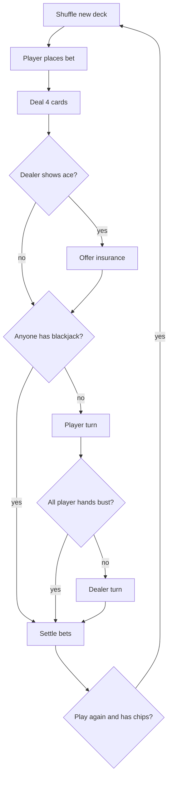

# Blackjack in Python — Program Plan

Sep 25, 2026 · @Gerian

## Overview & scope

This is a plan for a text-based Python blackjack game. One human player plays against a computer dealer, using a single 52-card deck that is reshuffled before every round.

| In scope | Out of scope |
| --- | --- |
| Hit, stand, double down, split (once), insurance | Surrender, re-splitting, doubling after a split |
| Dealer stands on all 17s, including soft 17 | Multiple decks, cut card, card counting |
| Basic chip balance and betting | GUI, multiple human players, saved games |
| Text-based interface in the terminal | Side bets, statistics, strategy hints |

## Quick summary of the rules

The goal is to finish with a hand total closer to 21 than the dealer's without going over 21.

- **Card values:** 2–10 count at face value. Jack, Queen and King count as 10. An ace counts as 11, or as 1 if 11 would take the hand over 21.
- **Soft and hard hands:** a hand is *soft* when an ace is counted as 11 (A+6 = soft 17), and *hard* otherwise (10+7 = hard 17).
- **Blackjack (a "natural"):** an ace plus a 10-value card as the first two cards. It beats every other 21 and pays 3:2.
- **Bust:** a total over 21 loses immediately, even if the dealer busts later.
- **Player turn:** the player hits (takes a card) until they stand or bust. Doubling, splitting and insurance are described under Player actions.
- **Dealer turn:** the dealer has no choices. The dealer draws on 16 or less and stands on 17 or more, including soft 17.
- **Result:** a higher total wins and pays 1:1, a lower total loses the bet, and a tie is a *push* that returns the bet.

Sources: [Pagat – Blackjack](https://www.pagat.com/banking/blackjack.html), [ReadyBetGo – Soft 17 rule](https://www.readybetgo.com/blackjack/strategy/soft-17-rule-2496.html).

## Game components

Each round follows a fixed order: shuffle, bet, deal four cards, check for blackjack, the player's turn, the dealer's turn, then settle.

| Component | Setup |
| --- | --- |
| Players | 1 human player and 1 computer dealer |
| Deck | 1 standard deck: 52 cards, 4 suits × 13 ranks |
| Deck order | A fresh deck is built and shuffled at the start of every round, and cards are drawn from the top |
| Cards per round | At most about 20 cards are used in one round, even with a split, so the deck never runs out |

### Deal order

1. Player: card 1, face up
2. Dealer: card 1, face up (the *upcard*)
3. Player: card 2, face up
4. Dealer: card 2, face down (the *hole card*)

### Round flow



The dealer checks for blackjack ("peeks") only when the upcard is an ace or a 10-value card. If all the player's hands bust, the dealer reveals the hole card but does not draw.

## Core gameplay: player actions

The game only offers actions that are legal right now. For example, "Double" disappears after the third card.

| Action | When it is allowed | What happens |
| --- | --- | --- |
| Hit | Hand total below 21, and the hand is not a split-ace hand | Take 1 card. Bust above 21. |
| Stand | Any time during the player's turn | End this hand. |
| Double down | First 2 cards only, not on split hands, and the player has chips to match the bet | Bet is doubled, the player takes exactly 1 card, and the hand ends. |
| Split | First 2 cards of equal rank, only once per round, and the player has chips to match the bet | Two hands, each with the original bet, and each gets a second card. The hands are played left to right. |
| Insurance | Dealer upcard is an ace, before the dealer peeks | Side bet of up to half the main bet. Pays 2:1 if the dealer has blackjack. |

### Payouts

| Result | Payout |
| --- | --- |
| Blackjack (natural) | 3:2 (bet 10 → win 15) |
| Normal win | 1:1 |
| Insurance win | 2:1 on the insurance bet |
| Push | Bet returned |
| Loss or bust | Bet lost |

## Basic money system

The player has a chip balance, bets before each round, and the balance changes by the payouts above. The exact numbers will be decided later. Until then, the placeholder values are 1000 starting chips, a 10 minimum bet, a 500 maximum bet and a 3:2 blackjack payout. Keep them in one settings file so they are easy to change.

- Take the bet from the balance when it is placed, and take extra chips when the player doubles, splits or buys insurance.
- At settlement, return the stake plus winnings: win = 2 × bet, blackjack = 2.5 × bet, push = 1 × bet, loss = 0.
- Show the balance before each bet and after each round.

## Program structure

Use six small classes and keep the game rules separate from `input()` and `print()`. That way the rules can be unit tested without typing, and a GUI could be added later. This follows the common object-oriented breakdown ([OOD case study](https://github.com/tssovi/grokking-the-object-oriented-design-interview/blob/master/object-oriented-design-case-studies/design-blackjack-and-a-deck-of-cards.md), [Braude OOP project](https://samyzaf.com/braude/OOP/PROJECTS/blackjack/blackjack.pdf)).

| Class | Holds | Main methods |
| --- | --- | --- |
| `Card` | rank, suit | `value`, `__str__` (for example "K♠") |
| `Deck` | list of 52 cards | `shuffle()`, `deal()` |
| `Hand` | cards, bet, `is_split`, `is_doubled` | `add()`, `total()`, `is_soft()`, `is_blackjack()`, `is_bust()`, `can_split()`, `can_double()` |
| `Player` | chip balance, list of hands | `place_bet()`, `can_afford()` |
| `Dealer` | one hand | `upcard()`, `should_hit()` (total < 17) |
| `Game` | deck, player, dealer | `play_round()`, `deal()`, `player_turn()`, `dealer_turn()`, `settle()` |

A separate `ui.py` does all the printing and input: `ask_bet()`, `ask_action(options)`, `show_table()` and `show_result()`.

### Files

- main.py: starts the game loop
- cards.py: Card and Deck
- hand.py: Hand
- players.py: Player and Dealer
- game.py: Game (rules and round flow)
- ui.py: text input and output
- settings.py: money and rule settings
- tests/: unit tests (pytest)

## Text interface

The interface is plain terminal text, one prompt at a time. The only options shown are the ones that are legal right now.

```
Chips: 1000
Place your bet (10-500, q to quit): 50

Dealer:  K♠  [??]
You:     8♥  8♣   (16)

[H]it  [S]tand  [D]ouble  S[p]lit: p

Hand 1:  8♥  3♦   (11)
[H]it  [S]tand: h
Hand 1:  8♥  3♦  10♠   (21)  -> stands

Hand 2:  8♣  9♠   (17)
[H]it  [S]tand: s

Dealer:  K♠  6♦   (16) -> hits
Dealer:  K♠  6♦  7♣   (23)  BUST

Hand 1: WIN  +50
Hand 2: WIN  +50
Chips: 1100
```

## Build order and testing

Build from the smallest piece upward and test each step before moving on.

1. `Card` and `Deck`: build, shuffle and deal. Test that the deck has 52 unique cards.
2. `Hand.total()` and `is_soft()`: test edge cases 1–3 (multiple aces, soft to hard, soft 17).
3. Basic round: bet, deal, hit, stand, dealer plays, settle. Test win, loss, push and bust.
4. Blackjack checks and dealer peek: test edge cases 5–10.
5. Double down: test edge case 16 and the rule that only one card is drawn.
6. Split: test edge cases 11–15 and 19.
7. Insurance: test edge cases 21–24.
8. Input validation and game end: edge cases 25–28.

**Testing tip:** give `Deck` an optional preset card list, so tests can deal exact hands (for example A, 6 for the dealer) instead of relying on luck.

## Open decisions

- [ ] Starting chips, minimum bet and maximum bet
- [ ] Rounding for 3:2 payouts on odd bets (half chips, round down, or even bets only)
- [ ] Allow splitting any two 10-value cards (K+Q), or identical ranks only
- [ ] Offer "even money" when the player has blackjack against a dealer ace
- [ ] Show both soft totals ("7 or 17") or only the best total

## Edge case rules

Most blackjack bugs hide in these cases. Each one needs its own unit test.

### Aces and hand totals

1. **Several aces:** count every ace as 1, then add 10 once if the total stays at 21 or less. A+A+9 = 21, and A+A+A+8 = 21.
2. **Soft becomes hard:** A+6 (soft 17) plus a 10 is 17, not 27. The ace drops to 1.
3. **Soft 17 for the dealer:** A+6 stands, and so do A+2+4 and A+A+5. The dealer only draws on 16 or less.
4. **Showing totals:** show both values for soft hands ("7 or 17"), or only the best one. This is a display choice; see Open decisions.

### Blackjack checks

5. **Player and dealer both have blackjack:** push, and the bet is returned.
6. **Player blackjack only:** paid 3:2 right away, with no player turn.
7. **Dealer blackjack only:** every player hand loses right away, including a player 21 made from 3 or more cards later. Only the original bet is lost, because doubles and splits never happened.
8. **Only the first 2 cards count as blackjack:** 21 from 3 or more cards is a normal 21 and pays 1:1.
9. **21 after a split is not blackjack:** A+K on a split hand pays 1:1.
10. **3:2 with odd bets:** a bet of 5 wins 7.5. Either allow half chips, round down, or only allow even bets.

### Splitting

11. **Same rank vs same value:** only allow splitting identical ranks (8+8, K+K), not K+Q. Some casinos allow any two 10-value cards; see Open decisions.
12. **Split aces:** each ace gets exactly 1 more card and the hand ends automatically, with no hit or double.
13. **No re-split:** if a split hand gets another pair (8, 8 → 8, 8), it cannot be split again.
14. **No double after split:** double down is not offered on split hands.
15. **Each split hand is settled separately:** one hand can win while the other loses or pushes.
16. **Not enough chips:** split and double are hidden when the balance is lower than the bet.

### Busting and the dealer

17. **Player bust always loses:** even if the dealer busts afterwards.
18. **All player hands bust:** the dealer reveals the hole card but does not draw.
19. **One split hand busts:** the dealer still plays for the hand that is left.
20. **Dealer bust:** every player hand that did not bust wins 1:1.

### Insurance

21. **Insurance only on an ace upcard:** not on a 10-value upcard.
22. **Insurance and dealer blackjack:** insurance pays 2:1 and the main bet loses, so the player breaks even.
23. **Insurance and no dealer blackjack:** insurance is lost and play continues as normal.
24. **Even money:** if the player has blackjack and the dealer shows an ace, taking insurance is the same as accepting 1:1 on the blackjack right away. Offer "even money" or skip it.

### Input and game end

25. **Invalid input:** typos, letters where a number should be, and empty input ask again instead of crashing.
26. **Bets:** must be a whole number, above zero, and no more than the balance.
27. **Out of chips:** the game ends when the balance is below the minimum bet.
28. **Quitting:** the player can type "q" between rounds, and the final balance is shown.
